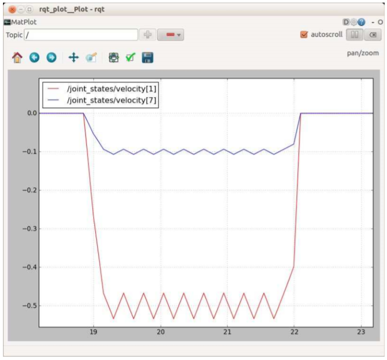

# 11.16.1 Тестирование контроллеров траектории движения суставов ArbotiX при моделировании


Напомним, что контроллеры траектории движения суставов реагируют на сообщения типа FollowJointTrajectoryGoal, которые слишком длинные и сложные, чтобы набирать их вручную в командной строке. Поэтому для иллюстрации процесса мы будем использовать простой скрипт Python. Сценарий называется trajectory\_demo.py и его можно найти в каталоге сценариев rbx2\_arm\_nav/. Прежде чем посмотреть на код, давайте испытаем его.

Если у вас все еще есть Move It! demo.lunch файл, запущенный из более раннего сеанса, завершите его. Затем начните с запуска версии Pi Robot для одной руки в игровом режиме \(sim: = true\):

```text
$ roslaunch rbx2_bringup pi_robot_with_gripper.launch sim: = true
```

На экране должны появиться следующие выходные данные:

```text
process[right_gripper_controller - 2] : started with pid[11853]
process[robot_state_publisher - 3] : started with pid[11859]
[INFO][WallTime:1401976945.363225] ArbotiX being simulated.
[INFO][WallTime:1401976945.749586] Started FollowController
(right_arm_controller).Joints : ['right_arm_shoulder_pan_joint',
'right_arm_shoulder_lift_joint', 'right_arm_shoulder_roll_joint',
'right_arm_elbow_flex_joint', 'right_arm_forearm_flex_joint',
'right_arm_wrist_flex_joint'] on C1
[INFO][WallTime:1401976945.761165] Started FollowController
(head_controller).Joints : ['head_pan_joint', 'head_tilt_joint'] on C2
```

Ключевые элементы выделены жирным шрифтом выше: запускается правый контроллер захвата; Контроллер ArbotiX работает в режиме моделирования; и контроллеры траектории движения суставов \(здесь называемые контроллерами следования\) запускаются для правой руки и головы.

Затем вызовите RViz с помощью конфигурационного файла arm\_sim.rviz из пакета rbx2\_arm\_nav:

```text
$ rosrun rviz rviz-d 'rospack find rbx2_arm_nav '/config/arm_sim.rviz
```

Теперь запустите сценарий trajectory\_demo.py. Обратите внимание, что мы вообще не используем MoveIt! в этот момент. Сценарий просто отправляет пару запросов траектории суставов \(один для руки и один для головы\) контроллерам траектории движения, которые были запущены нашим файлом запуска ранее. Если контроллеры успешно реализуют требуемые траектории, рука и голова должны двигаться вверх и вправо плавно и одновременно:

```text
$ rosrun rbx2_arm_nav trajectory_demo.py _reset:=false _sync:=true 
```


Чтобы переместить рычаг и голову обратно в исходное состояние, выполните команду с параметром reset, имеющим значение true:

```text
$ rosrun rbx2_arm_nav trajectory_demo.py _reset:=true _sync:=true
```

Чтобы переместить сначала руку, а затем голову, запустите сценарий со значением false  параметра sync:

```text
“$ rosrun rbx2_arm_nav trajectory_demo.py _reset:=false _sync:=false”
```

Давайте посмотрим на код.

Ссылка на источник: trajectory\_demo.py

```text
#!/ usr / bin / env python 

 import rospy
 import actionlib
 
 from control_msgs.msg import FollowJointTrajectoryAction 
 from control_msgs.msg import FollowJointTrajectoryGoal 
 from trajectory_msgs.msg import JointTrajectory, JointTrajectoryPoint 

 class TrajectoryDemo() : 
 def __init__(self) : 
 rospy.init_node('trajectory_demo')

        # Set to True to move back to the starting configurations 
        reset = rospy.get_param('~reset', False)

        # Set to False to wait for arm to finish before moving head 
        sync = rospy.get_param('~sync', True)

 # Which joints define the arm ? 
 arm_joints = ['right_arm_shoulder_pan_joint', 
 'right_arm_shoulder_lift_joint',
 'right_arm_shoulder_roll_joint', 
 'right_arm_elbow_flex_joint', 
 'right_arm_forearm_flex_joint', 
 'right_arm_wrist_flex_joint'] 

 # Which joints define the head ?
 head_joints = ['head_pan_joint', 'head_tilt_joint'] 

 if reset : 
 # Set the arm back to the resting position 
 arm_goal = [0, 0, 0, 0, 0, 0] 
            
 # Re - center the head 
 head_goal = [0, 0] 
        else : 
 # Set a goal configuration for the arm
 arm_goal = [-0.3, -2.0, -1.0, 0.8, 1.0, -0.7]
           
 # Set a goal configuration for the head 
 head_goal = [-1.3, -0.1]

 # Connect to the right arm trajectory action server 
 rospy.loginfo('Waiting for right arm trajectory controller...') 

        arm_client = actionlib.SimpleActionClient('right_arm_controller/follow_joint_trajectory', FollowJointTrajectoryAction) 

        arm_client.wait_for_server() 

        rospy.loginfo('...connected.') 
         
 # Connect to the head trajectory action server 
 rospy.loginfo('Waiting for head trajectory controller...')

        head_client = actionlib.SimpleActionClient('head_controller/follow_joint_trajectory', FollowJointTrajectoryAction) 

        head_client.wait_for_server() 

        rospy.loginfo('...connected.')   
 
 # Create an arm trajectory with the arm_goal as the end - point 
 arm_trajectory = JointTrajectory() 
 arm_trajectory.joint_names = arm_joints 
 arm_trajectory.points.append(JointTrajectoryPoint())
 arm_trajectory.points[0].positions = arm_goal
 arm_trajectory.points[0].velocities = [0.0 for i in arm_joints]
 arm_trajectory.points[0].accelerations = [0.0 for i in arm_joints]
        arm_trajectory.points[0].time_from_start = rospy.Duration(3.0) 

 # Send the trajectory to the arm action server 
 rospy.loginfo('Moving the arm to goal position...') 

 # Create an empty trajectory goal 
 arm_goal = FollowJointTrajectoryGoal()

        # Set the trajectory component to the goal trajectory created above 
        arm_goal.trajectory = arm_trajectory

 # Specify zero tolerance for the execution time 
 arm_goal.goal_time_tolerance = rospy.Duration(0.0)

 # Send the goal to the action server 
 arm_client.send_goal(arm_goal) 

 if not sync: 
 # Wait for up to 5 seconds for the motion to complete 
            arm_client.wait_for_result(rospy.Duration(5.0))

 # Create a head trajectory with the head_goal as the end - point 
 head_trajectory = JointTrajectory() 
 head_trajectory.joint_names = head_joints
 head_trajectory.points.append(JointTrajectoryPoint()) 
 head_trajectory.points[0].positions = head_goal
 head_trajectory.points[0].velocities = [0.0 for i in head_joints] 
 head_trajectory.points[0].accelerations = [0.0 for i in head_joints] 
        head_trajectory.points[0].time_from_start = rospy.Duration(3.0) 

 # Send the trajectory to the head action server 
 rospy.loginfo('Moving the head to goal position...') 

 head_goal = FollowJointTrajectoryGoal() 
 head_goal.trajectory = head_trajectory
        head_goal.goal_time_tolerance = rospy.Duration(0.0) 

# Send the goal 
 head_client.send_goal(head_goal) 

 # Wait for up to 5 seconds for the motion to complete  
 head_client.wait_for_result(rospy.Duration(5.0)) 

```

Давайте разбьем это по строкам:

```text
6 from control_msgs.msg import FollowJointTrajectoryAction
7 from control_msgs.msg import FollowJointTrajectoryGoal
8 from trajectory_msgs.msg import JointTrajectory, JointTrajectoryPoint
```

Сначала необходимо импортировать несколько типов сообщений и действий для использования с траекториями. Ранее в этой главе мы уже встретили действие FollowJointIngerAction и сообщение FollowJointIngerGoal. Следует напомнить, что ключевым компонентом этих объектов является определение траектории соединения с точки зрения положений соединения, скоростей, ускорений и силы. Поэтому также необходимо импортировать типы сообщений JointTraction и JointTraction.

```text
14 # Set to True to move back to the starting configurations
15 reset = rospy.get_param('~reset', False)
16
17 # Set to False to wait for arm to finish before moving head
18 sync = rospy.get_param('~sync', True)
```

Параметр reset позволяет нам перемещать руку и голову в их начальные позиции. Параметр синхронизации определяет, запускаются траектории руки и головы одновременно или одна за другой.

```text
20 # Which joints define the arm ?
21 arm_joints = ['right_arm_shoulder_pan_joint',
22 'right_arm_shoulder_lift_joint',
23 'right_arm_shoulder_roll_joint',
24 'right_arm_elbow_flex_joint',
25 'right_arm_forearm_flex_joint',
26 'right_arm_wrist_flex_joint']
27
28 # Which joints define the head ?
29 head_joints = ['head_pan_joint', 'head_tilt_joint']
```

Далее мы создадим два списка, содержащие названия суставов для руки и головы соответственно. При указании цели траектории нам потребуются имена этих соединений.

```text
31 if reset:
32 # Set the arm back to the resting position
33 arm_goal = [0, 0, 0, 0, 0, 0]
34            
35            # Re - center the head
36            head_goal = [0, 0]      
37        else:
38 # Set a goal configuration for the arm
39 arm_goal = [-0.3, -2.0, -1.0, 0.8, 1.0, -0.7]
40            
41 # Set a goal configuration for the head
42 head_goal = [-1.3, -0.1]
```

Здесь мы определяем две целевые конфигурации с точки зрения положений суставов, одну для руки и одну для головы. Конкретно в этих значениях нет ничего особенного, и Вы можете попробовать другие углы соединения, какие хотите. Однако следует помнить, что позиции соединения перечислены в том же порядке, что и имена соединений, определенные выше. Если в командной строке для параметра reset установлено значение True, то позиции цели возвращаются в нейтральное положение, когда рука висит прямо вниз, а голова центрирована.

```text
47        arm_client = actionlib.SimpleActionClient('right_arm_controller/follow_joint_trajectory', FollowJointTrajectoryAction)
48       
49        arm_client.wait_for_server()
```

Далее мы создаем простого клиента действий, который подключается к серверу действий с траекторией суставов для правого плеча. Напомним, что пространство имен для этого контроллера было определено в файле конфигурации для контроллеров arbotix с помощью параметра action\_name.

```text
56        head_client = actionlib.SimpleActionClient('head_controller/follow_joint_trajectory', FollowJointTrajectoryAction)
57      
58        head_client.wait_for_server()
```

И здесь мы делаем то же самое для сервера траектории движения головы. Теперь мы можем использовать arm\_client и head\_client объекты для отправки траекторных целей этим двум совместным группам.

```text
62 # Create an arm trajectory with the arm_goal as a single end - point
63 arm_trajectory = JointTrajectory()
64 arm_trajectory.joint_names = arm_joints
65 arm_trajectory.points.append(JointTrajectoryPoint())
66 arm_trajectory.points[0].positions = arm_goal 67 arm_trajectory.points[0].velocities = [0.0 for i in arm_joints]
68 arm_trajectory.points[0].accelerations = [0.0 for i in arm_joints]
69 arm_trajectory.points[0].time_from_start = rospy.Duration(3.0)
```

Чтобы создать цель траектории суставов для руки, мы фактически собираемся использовать всего одну точку \(конфигурацию соединения\); а именно, позиции целей, которые мы хранили ранее в переменной arm\_goal. Другими словами, мы собираемся определить траекторию, указав только ее конечную точку. Причина, по которой мы можем избавиться от этого, заключается в том, что сервер траектории движения сустовов будет интерполировать дополнительные конфигурации сустаов между начальной конфигурацией и конфигурацией цели, в которую мы его посылаем. Хотя, конечно, можно указать дополнительные конфигурации рычагов на этом пути, но почему бы не позволить серверу действий выполнить работу за нас?

Строка 63 выше создает пустой объект JointTrajectory. В строке 64 мы заполняем имена суставов для этой траектории именами суставов руки, которые мы перечислили ранее и хранили в переменной arm\_joints. Напомним, что траектория суставов состоит из массива \(или списка в Python\) точек траектории. Таким образом, в строке 65 мы добавляем пустую JointEnClosure, которая будет заполнена нашей целевой конфигурацией. Эта точка имеет индекс 0 в списке точек траектории. В строке 66 мы устанавливаем значения положения для этой точки для наших целевых позиций, как сохранено в переменной arm\_goal. Затем мы устанавливаем скорость и ускорение на 0,0 для каждого сустава, так как это конечная точка для нашей траектории, чтобы рука будет остановлена. Наконец, в строке 69 мы установили time\_from\_start для этой точки в 3,0 секунды. Это означает, что мы хотим, чтобы траектория прошла через эту точку через 3 секунды после начала движения. Но поскольку это конечная точка траектории, то это также означает, что мы хотим, чтобы все движение было выполнено примерно за 3 секунды.

После создания одноточечной целевой траектории мы готовы отправить ее на сервер действий:

```text
74 # Create an empty trajectory goal
75 arm_goal = FollowJointTrajectoryGoal()
76       
77        # Set the trajectory component to the goal trajectory created above
78        arm_goal.trajectory = arm_trajectory
79        
80 # Specify zero tolerance for the execution time
81 arm_goal.goal_time_tolerance = rospy.Duration(0.0)
82    
83 # Send the goal to the action server
84 arm_client.send_goal(arm_goal)
85       
86 if not sync:
87 # Wait for up to 5 seconds for the motion to complete
88 arm_client.wait_for_result(rospy.Duration(5.0))
```

В строке 75 мы создадим пустое сообщение FollowJointIndicationGoal. Затем в Линии 78 мы устанавливаем целевую траекторию, составляющую траекторию плеча, которую мы только что создали выше. На линии 81 мы говорим, что хотим, чтобы траектория заканчивалась вовремя, что составило 3,0 секунды в соответствии с нашей time\_from\_start настройкой. Если рука может достичь пункта назначения чуть позже, здесь можно увеличить допуск. Строка 84 посылает фактическую цель траектории на сервер действий, используя метод send\_goal \(\) на объекте arm\_client. Наконец, если мы не выполним траектории руки и головы одновременно, линия 88 будет ждать 5 секунд, пока траектория не закончится или закончится с ошибкой.

Остальная часть сценария просто повторяет процедуру для траектории головы.

Есть несколько вещей, которые стоит отметить о траекториях, генерируемых сценарием:

*  Несмотря на то, что мы указали только одну точку траектории \(конечную конфигурацию для соединения с суставами головы или руки\), контроллер траектории движения суставов arbotix создал промежуточные конфигурации суставов, тем самым позволяя руке или голове плавно перемещаться между начальной и конечной конфигурациями.
*  Все суставы \(либо в руке, либо в наклоненной голове\) прекращают движение одновременно. Это можно подтвердить визуально, наблюдая симуляцией робота в RViz или используя rqt\_plot для графического тестирования. Например, следующая команда построит график скорости суставов для head\_pan и head\_tilt по ходу движения:

```text
$ rqt_plot /joint_states/velocity[1]:velocity[7]  
```

На следующем графике показаны скорости поворота и наклона при выполнении сценария trajectory\_demo.py:



Обратите внимание на то, как два сустава начинают и заканчивают двигаться одновременно.

* Напомним, что мы установили time\_from\_start для траектории руки и головы на 3 секунды. На рисунке числа вдоль оси x представляют время в секундах. Поэтому видно, что движение головы заняло чуть более 3 секунд.

