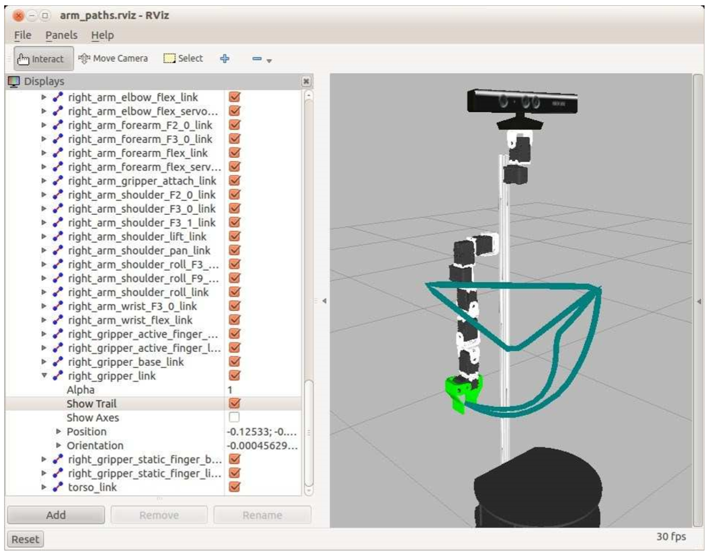
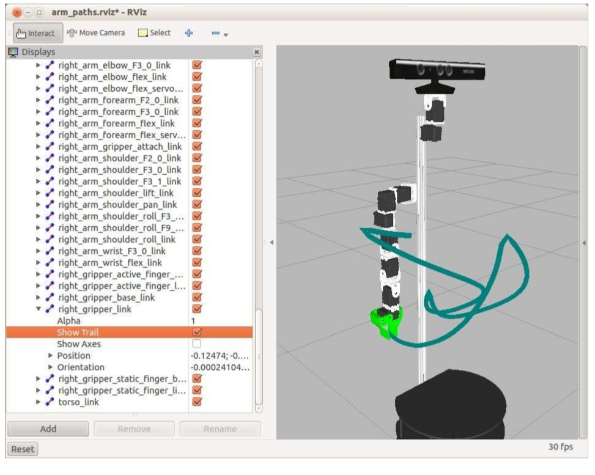

# 11.22.1 Выполнение декартовых путей


Предположим, мы хотим, чтобы конечный эффектор робота следовал прямолинейным траекториям через пространство, когда он движется через последовательность позиций или путевых точек. MoveIt! Включает в себя функцию compute\_cartesian\_path \(\), которая выполняет трюк. Конечно, отдельные позиции путевых точек должны быть доступны решателем IK, иначе процесс не будет выполнен. В простейшем случае мы можем использовать только две путевые точки: стартовую и целевую позы. Функция compute\_cartesian\_path \(\) затем может использоваться для перемещения конечного эффектора по прямой линии между двумя позициями.

Чтобы увидеть, как это работает, взгляните на сценарий под названием moveit\_cartesian\_demo.py, находящийся в каталоге rbx2\_arm\_nav/scripts. Сценарий начинается с перемещения руки в позу "straight\_forward", хранящуюся в SRDF. Обратите внимание, что для этого первого движения используется команда regular go \(\), поэтому путь не должен быть прямым. Затем мы ставим эту позу в качестве стартовой путевой точки. Далее устанавливается путевая точка, расположенная на 0,2 метра сзади и справа от стартовой позиции. Следующая путевая точка опускается влево и снова вперед. Окончательная путевая точка возвращается к позе "straight\_forward". Наконец, мы перемещаем руку обратно в конфигурацию "resting" с помощью обычной команды go \(\).

Путевые точки, который передвются функции compute\_cartesian\_path \(\) в качестве аргументов, и, если все идет хорошо, захват должен двигаться по прямой линии между каждой последующей парой позиций путевых точек, формируя своего рода треугольник в пространстве.

Чтобы попробовать это, убедитесь, что у вас есть симуляционная версия Робота Pi, работающая в симуляторе ArbotiX, если это еще не так:

```text
$ roslaunch rbx2_bringup pi_robot_with_gripper.launch sim:=true
```

Если вы еще не работаете файлом запуска MovIt для Робота Pi, запустите это файл сейчас:

```text
$ roslaunch pi_robot_moveit_config move_group.launch
```

Если RViz уже запущен, закройте его, а затем снова запустите с помощью файла конфигурации arm\_paths.rviz. \(Также можно использовать опцию Open Config в меню  над вкладкой File и перейти к rbx2\_arm\_nav/config/arm\_paths.rviz.\)

```text
$ rosrun rviz rviz -d `rospack find rbx2_arm_nav`/config/arm_paths.rviz
```

Наконец, запустите демо-сценарий декартовых путей с параметром декартовых путей, имеющим значение true:

```text
$ rosrun rbx2_arm_nav moveit_cartesian_demo.py _cartesian:=true
```

Результат в RViz должен выглядеть следующим образом:




Равнобедренный треугольник на изображении формируется траекториями захвата при следовании по вычисленной декартовой траектории. Две криволинейные траектории - это траектории, которые формируются при использовании обычной команды go \(\).

ПРИМЕЧАНИЕ: Если сценарий завершается неуспешно, появляется следующее сообщение:

```text
Path planning failed with only 0.25 success after 100 attempts.
```

Затем просто запустите сценарий еще раз. Декартовый планировщик пути требует, чтобы для каждой позиции вдоль пути можно было найти IK-решение. Если решателю не удается найти решение для одного или нескольких путевых точек, то путь прерывается. Повторный запуск сценария обычно находит решение из-за случайного характера решателя KDL IK.

Путь отображается в RViz, так как в конфигурационном элементе arm\_paths.rviz установлен флажок рядом с полем Show Trail рядом с right\_gripper\_link в списке ссылок Planned Path, как показано на рисунке.

Затем попробуйте выполнить сценарий с декартовым параметром false. Это приведет к перемещению захвата во все целевые позиции с использованием обычной функции go \(\) без предварительного вычисления прямых траекторий. Перед выполнением следующей команды установите флажок рядом с параметром "Показать контур" \(Show Trail\) правого захвата, чтобы очистить текущий контур, если он все еще отображается. После этого запустите:

```text
$ rosrun rbx2_arm_nav moveit_cartesian_demo.py _cartesian:=false
```

На этот раз вид в RViz должен выглядеть примерно так.




Обратите внимание, что все траектории теперь изогнуты. При этом захват больше не остается горизонтальным вдоль треугольной части траектории. Более того, при повторном выполнении команды между одними и теми же путевыми точками появится потенциально другой набор траекторий. Это подчеркивает еще одну полезную особенность функции compute\_cartesian\_path \(\): она может перемещать захват таким же образом время от времени.

Теперь рассмотрим ключевые строки сценария.

Ссылка на источник: moveit\_cartesian\_demo.py

```text
16        cartesian = rospy.get_param('~cartesian', True)
```

Сначала мы читаем в параметре под названием cartesian \(декартова\), что этот параметр находится по умолчанию в состоянии True. Если параметр имеет значение True, вычисляются декартовы пути между набором путевых точек. Если установлено значение False, для перемещения руки используются обычные команды set\_pose\_target \(\) и go \(\). Таким образом мы можем сравнить прямолинейные траектории с траекториями, вычисленными обычным способом.

```text
33 # Get the name of the end-effector link
34 end_effector_link = right_arm.get_end_effector_link()
35                                        
36 # Start in the "straight_forward" configuration
37 right_arm.set_named_target("straight_forward")
```

Затем мы получаем название ссылки конечного эффектора и устанавливаем руку в конфигурацию «straight\_forward», которую мы определили, управляя MoveIt! Setup Assistant.

```text
43 # Remember this pose so we can add it as a waypoint
44 start_pose = right_arm.get_current_pose(end_effector_link).pose
45        
46 # Set the end pose to be the same as the resting pose
47 end_pose = deepcopy(start_pose)
```

После перемещения руки в позу «straight\_forward» мы устанавливаем переменные start\_pose и end\_pose такими, чтобы они совпадли с позицией resting, чтобы мы могли использовать их в качестве первой и последней путевой точки.

```text
49 # Initialize the waypoints list
50 waypoints = []
51                
52 # Set the first waypoint to be the starting pose
53 wpose = deepcopy(start_pose)
54        
55 if cartesian:
56 # Append the pose to the waypoints list
57 waypoints.append(deepcopy(wpose))
```

Затем выполняется инициализация списка для хранения путевых точек и установка переменной wpose в копию start\_pose. Если выполняется декартовый путь, то первая путевая точка добавляется в список waypoints. Заметим, что мы пока не двигаем руку - просто составляем список путевых точек.

```text
59 # Set the next waypoint back and to the right
60 wpose.position.x -= 0.2
61 wpose.position.y -= 0.2
62 if cartesian:
63 # Append the pose to the waypoints list
64            waypoints.append(deepcopy(wpose))
65        else:
66 right_arm.set_pose_target(wpose)
67 right_arm.go()
68 rospy.sleep(2)
```

Здесь устанавливается следующая позиция путевой точки 0,2 метра сзади и 0,2 метра справа от стартовой позиции. Если для параметра "cartesian" установлено значение "True", то к списку waypoints добавляется новая позиция. В противном случае, мы перемещаем конечный эффектор в новую позицию сразу и любым способом, выбранным планировщиком, используя стандартные команды set\_pose\_target \(\) и go \(\).

Следующие несколько строк \(которые мы пропустим здесь\) просто добавить еще одну путевую точку, которая устанавливает конечный эффектор снизу и позади средней линии робота. Для конечной путевой точки устанавливается начальная позиция \("direct \_ forward"\).

```text
95 fraction = 0.0
96 maxtries = 100
97 attempts = 0
98        
99        right_arm.set_start_state_to_current_state()
```

Перед вычислением и выполнением декартового пути мы устанавливаем счетчик количества разрешенных попыток и переменную, называемую fraction, о которой будем говорить дальше. Также устанавливается текущее состояние внутреннего запуска руки.

```text
101 # Plan the Cartesian path connecting the waypoints
102 while fraction < 1.0 and attempts < maxtries:
103 (plan, fraction) = right_arm.compute_cartesian_path(
104 waypoints,   # waypoint poses
105 0.01,        # eef_step
106 0.0          # jump_threshold
107 True)        # avoid_collisions
108            attempts += 1
109
110 if attempts % 100 == 0:
111 rospy.loginfo("Still trying after " + str(attempts) + " attempts...")
```

Ключевое утверждение здесь начинается на линии 103 и продолжается до лиинии 107. Здесь вызывается функция compute\_cartesian\_path \(\), которая принимает четыре аргумента:

* waypoints - список позиций, через которые должен пройти конечный эффектор
* eef\_step - максимальный шаг конечного эффектора \(в метрах\), допустимый между последовательными позициями его траектории. Мы установили это на 0,01 метра или 1 см.
* jump\_threshold – насколько малым мы хотим сделать прыжок руки в конфигурационном пространстве. Установка значения 0.0 отключает эту проверку.
*  avoid\_collisions - следует ли при планировании избегать конфликтов. Значением по умолчанию для этого аргумента является True.

Compute\_cartesian\_path \(\) возвращает два значения: вычисленный plan \(траектория\) для этой попытки и fraction \(доля\) путевых точек, успешно достигнутых с помощью этого плана. Для успешного плана мы хотим, чтобы доля была равна 1,0 \(100%\), поэтому мы переносим функцию compute\_cartesian\_path \(\) в цикл времени до тех пор, пока возвращенное значение переменной fraction не будет равно 1,0 или пока не закончатся попытки, как указано значением maxtries. \(Хотя в сценарии значение maxtres равно 100, его также можно передать в качестве параметра ROS.\)

```text
112        # If we have a complete plan, execute the trajectory
113        if fraction == 1.0:
114            rospy.loginfo("Path computed successfully. Moving the arm.")
115            right_arm.execute(plan)
116        else:
117            rospy.loginfo("Path planning failed with only " + str(fraction) + " success after " + str(maxtries) + " attempts.")
```

Наконец, если мы получим план, который проходит через 100% путевых точек, мы выполним его. В противном случае отображается сообщение "plan failed".

